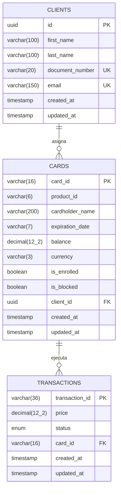

# Bank Inc - API REST

API bancaria desarrollada con **NestJS**, **TypeScript**, **TypeORM** y **PostgreSQL**, diseñada siguiendo una arquitectura en capas alineada con las buenas prácticas con la idea de facilitar una migración a Java / Spring Boot.

---

## Tabla de Contenidos
1. [Descripción del Negocio y Requerimientos](#-descripción-del-negocio-y-requerimientos)
2. [Arquitectura y Estructura del Proyecto](#-arquitectura-y-estructura-del-proyecto)
3. [Modelo de Base de Datos Relacional](#-modelo-de-base-de-datos-relacional)
4. [Flujos de Datos (Diagramas Mermaid)](#-flujos-de-datos-diagramas-mermaid)
5. [Guía de Ejecución Local y Docker](#-guía-de-ejecución-local-y-docker)
6. [Documentación de la API (Swagger y Postman)](#-documentación-de-la-api-swagger-y-postman)
7. [Pruebas Unitarias y Cobertura (>= 80%)](#-pruebas-unitarias-y-cobertura--80)

---

## Descripción del Negocio y Requerimientos

Bank Inc es una entidad que asigna tarjetas débito o crédito a clientes para compras en comercios asociados, manejando transacciones en **USD ($)**.

### Características de la Tarjeta
- **Número de 16 dígitos**: Los primeros 6 dígitos corresponden al identificador de producto (`productId`), y los 10 dígitos restantes son generados de manera aleatoria.
- **Titular de la cuenta**: Nombre y apellido del cliente asociado.
- **Fecha de vencimiento**: Formato `MM/YYYY`, exactamente 3 años posterior a su emisión.
- **Moneda**: Exclusivamente dólares (`USD`).
- **Estado de emisión**: Nace inactiva (`isEnrolled = false`), sin saldo (`0.00`) y sin bloquear (`isBlocked = false`).

### Reglas de Negocio
1. **Emisión de Tarjeta**: Generación del número único de 16 dígitos a partir del `productId` mediante `GET /card/{productId}/number`.
2. **Asignación y Activación (Enroll)**: Para poder operar, la tarjeta debe vincularse a un cliente existente mediante `POST /card/enroll { cardId, clientId, pin }`, asignando el titular y configurando su **PIN de seguridad de 4 dígitos** (por defecto `1234`).
3. **Bloqueo**: Mediante `DELETE /card/{cardId}`, tanto el **administrador** (por inconsistencias) como el **tarjetahabiente / CLIENT** (por pérdida o prevención) pueden bloquear la tarjeta.
4. **Recarga de Saldo**: `POST /card/balance` permite recargar fondos atómicamente a tarjetas no bloqueadas.
5. **Compras**: `POST /transaction/purchase` descuenta saldo atómicamente si:
   - La tarjeta existe y está activa (`isEnrolled = true`).
   - La tarjeta no está bloqueada (`isBlocked = false`).
   - La tarjeta está vigente (fecha actual <= vencimiento).
   - El **PIN de seguridad de 4 dígitos** coincide con el de la tarjeta.
   - Hay saldo suficiente disponible (saldo disponible >= precio).
6. **Anulación de Transacción**: `POST /transaction/anulation` permite reversar una compra y restituir el saldo si:
   - La transacción existe y pertenece a la tarjeta.
   - La transacción no ha sido anulada previamente.
   - La transacción fue creada hace **menos de 24 horas**.

---

## Arquitectura y Estructura del Proyecto

El proyecto implementa una arquitectura modular en capas:

```
src/
├── common/
│   ├── filters/                 # AllExceptionsFilter (Manejo centralizado de errores)
│   └── utils/                   # CardUtils (generador de tarjetas, fechas, 24h)
├── config/
│   └── database.config.ts       # Configuración TypeORM y PostgreSQL
├── modules/
│   ├── client/                  # Módulo de Clientes
│   │   ├── dto/                 # CreateClientDto
│   │   ├── entities/            # Client.entity.ts
│   │   ├── client.controller.ts
│   │   ├── client.service.ts
│   │   └── client.module.ts
│   ├── card/                    # Módulo de Tarjetas
│   │   ├── dto/                 # EnrollCardDto, RechargeBalanceDto
│   │   ├── entities/            # Card.entity.ts
│   │   ├── card.controller.ts
│   │   ├── card.service.ts
│   │   └── card.module.ts
│   └── transaction/             # Módulo de Transacciones
│       ├── dto/                 # PurchaseTransactionDto, AnulateTransactionDto
│       ├── entities/            # Transaction.entity.ts
│       ├── transaction.controller.ts
│       ├── transaction.service.ts
│       └── transaction.module.ts
├── app.module.ts
└── main.ts
```

---

## Modelo de Base de Datos Relacional



---

## Flujos de Datos (Diagramas Mermaid)

### Flujo de Emisión y Activación de Tarjeta


### Flujo de Compra y Anulación (< 24 Horas)


---

## Guía de Ejecución Local y Docker

### Opción 1: Ejecución con Docker Compose (Recomendada - 1 Solo Comando)
Requiere tener instalado **Docker** y **Docker Compose**:

```bash
docker compose up --build
```
Esto levantará:
- **PostgreSQL 15** en el puerto `5432`.
- **Bank Inc API** en el puerto `3000`.
- Creación automática de esquemas y seeder de clientes iniciales.

### Opción 2: Ejecución Local con Node.js y PostgreSQL Local
1. Instalar dependencias:
   ```bash
   npm install
   ```
2. Configurar el archivo `.env` con las credenciales de tu base de datos:
   ```env
   PORT=3000
   DB_HOST=localhost
   DB_PORT=5432
   DB_USERNAME=postgres
   DB_PASSWORD=postgres
   DB_NAME=bank_inc_db
   DB_SYNCHRONIZE=true
   DB_LOGGING=false
   ```
3. Ejecutar en modo desarrollo:
   ```bash
   npm run start:dev
   ```

---

## Documentación de la API (Swagger y Postman)

### Swagger / OpenAPI Interactivo
Una vez levantada la aplicación, accede a la interfaz interactiva en:
**[http://localhost:3000/api/docs](http://localhost:3000/api/docs)**

### Colección de Postman
En la raíz del proyecto se encuentra el archivo `postman_collection.json` con todos los endpoints organizados y variables de entorno configuradas:
1. Abre Postman -> Clic en **Import**.
2. Selecciona `postman_collection.json`.
3. Todos los requests (Nivel 1 y Nivel 2) están listos para ejecutar en orden.

---

## Pruebas Unitarias y Cobertura (>= 80%)

Para ejecutar la suite completa de pruebas unitarias con Jest:

```bash
npm run test:cov
```

La suite cubre:
- Generación de tarjetas de 16 dígitos y validación estricta de 6 dígitos de `productId`.
- Reglas de vencimiento a 3 años y control de fechas pasadas/futuras.
- Transacciones de compra atómicas, concurrencia y validaciones de saldo.
- Regla de anulación en ventana de 24 horas y rechazo posterior a las 24 horas.
- Activación y enrolamiento con clientes existentes.
- Bloqueo y denegación de compras en tarjetas bloqueadas.

---

## Seguridad Bancaria y Canales de Acceso (RBAC)

Para cumplir con estándares de seguridad, la API implementa un modelo de **Control de Acceso Basado en Roles por Canales (RBAC)** a través del header HTTP `x-api-key`:


### Llaves Preconfiguradas (para Swagger y Postman)
| Canal | Rol | Clave `x-api-key` | Operaciones Permitidas |
| :--- | :--- | :--- | :--- |
| **Backoffice Bancario** | `ADMIN` | `admin-key-123` | **Superusuario: Tiene acceso total a todos los endpoints** (emisión, bloqueo, auditoría). |
| **Tarjetahabiente / App** | `CLIENT` | `client-key-456` | Compras (`/transaction/purchase`), Recargas de saldo y Consulta de saldo. |
| **Comercio / Datáfono** | `MERCHANT` | `merchant-key-789` | Anulación de compras (`/transaction/anulation`) y consulta de transacciones. |

> **Nota de Compatibilidad**: La seguridad puede desactivarse dinámicamente configurando en el `.env`:
> `SECURITY_ENABLED=false`

---

